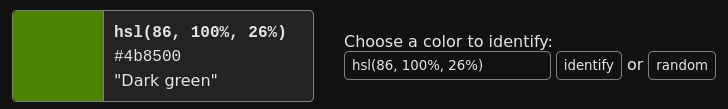
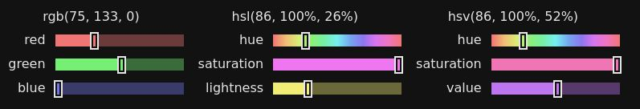
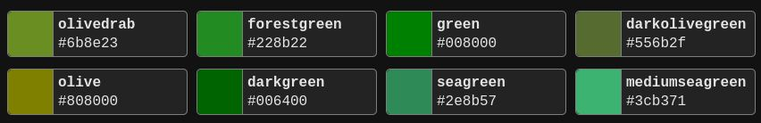
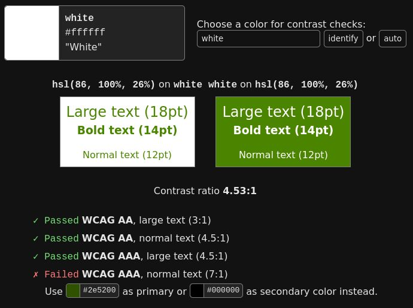

# Color ID 

A tool to get various information about colors. Available at <https://color-id.timjen.net>.

## Features

### Color Identification

Get an easy-to-understand description of each color.
This is especially useful for color-deficient users.

### Color Composition

View the composition of the color in different color spaces.
Move around the sliders to experiment with different colors.

### Similar CSS Colors

Identify named CSS colors that look similar to the given color.

### Accessbility

Check the contrast of two colors based on the WCAG accessibility guidelines.
If a contrast check fails, a similar looking color with better contrast is recommended.

